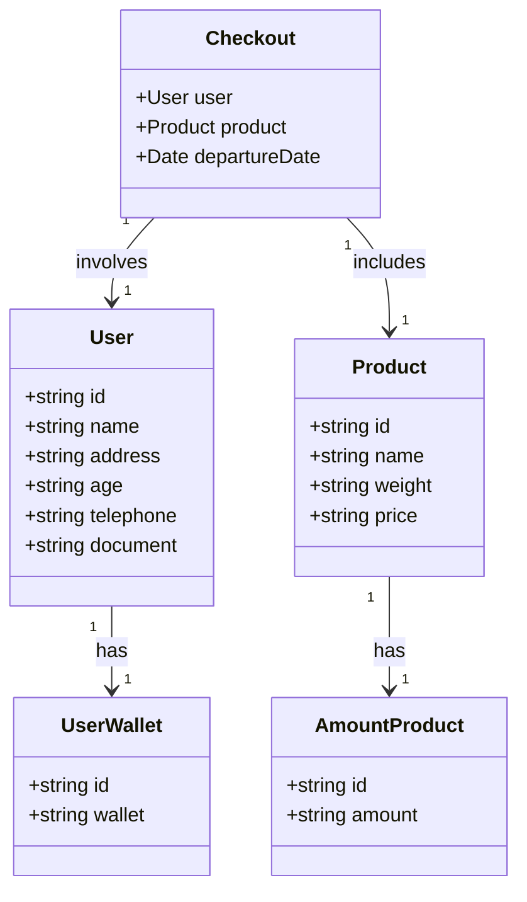

```mermaid
  classDiagram
    class User {
        +string id
        +string name
        +string address
        +string age
        +string telephone
        +string document
    }
    
    class UserWallet {
        +string id
        +string wallet
    }
    
    class Product {
        +string id
        +string name
        +string weight
        +string price
    }
    
    class AmountProduct {
        +string id
        +string amount
    }
    
    class Checkout {
        +User user
        +Product product
        +Date departureDate
    }
    
    User "1" --> "1" UserWallet : has
    Product "1" --> "1" AmountProduct : has
    Checkout "1" --> "1" User : involves
    Checkout "1" --> "1" Product : includes
```
